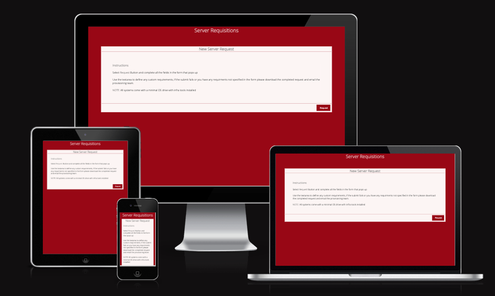
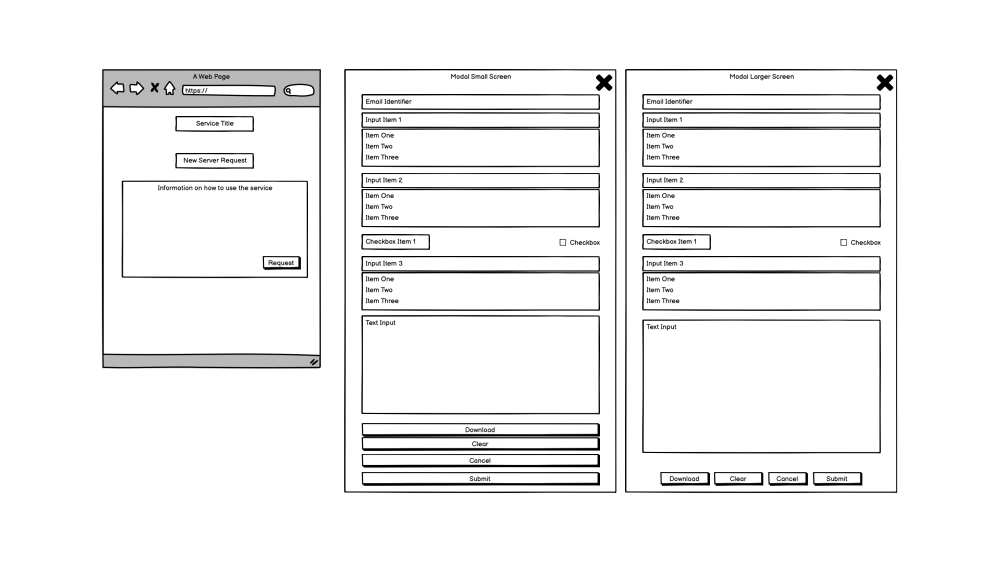
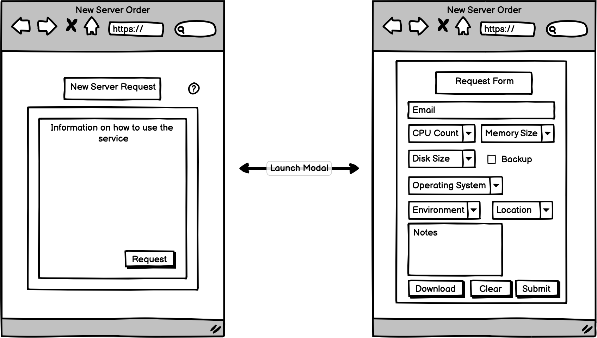
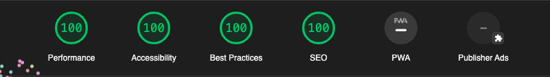

# Hunt Showdown
(Developer: Gary Grant)

[Live Site](https://bovinehero.com/vm-order-generator/index.html) is hosted on github pages with a custom DNS CNAME provided by Google DNS.

## Table of Content

1. [Project Goals](#project-goals)
    1. [User Goals](#user-goals)
    2. [Client Goals](#client-goals)
2. [User Experience](#user-experience)
    1. [Key Information on the Site](#key-information-on-the-site)
    2. [Target Audience](#target-audience)
    3. [User Requirements and Expectations](#user-requirements-and-expectations)
    4. [User Stories](#user-stories)
3. [Design](#design)
    1. [Design Considerations](#design-considerations)
    2. [Colour](#colour)
    3. [Fonts](#fonts)
    5. [Imagery](#imagery)
    4. [Structure](#structure)
    5. [Wireframes](#wireframes)
4. [Technologies Used](#technologies-used)
    1. [Languages](#languages)
    2. [Frameworks and Tools](#frameworks-and-tools)
5. [Features](#features)
    1. [Future Implementations](#future-implementations)
    2. [Accessibility Features](#accessibility-features)
6. [Testing](#testing)
    1. [HTML Validation](#HTML-validation)
    2. [CSS Validation](#CSS-validation)
    3. [JavaScript Validation](#JavaScript-validation)
    3. [Accessibility](#accessibility)
    4. [Performance](#performance)
    5. [Device Testing](#device-testing)
    6. [Browser Compatibility](#browser-compatibility)
    7. [Testing User Stories](#testing-user-stories)
8. [Bugs](#bugs)
9. [Deployment & Local Development](#deployment)
10. [Credits](#credits)
11. [Acknowledgments](#acknowledgments)

## Project Goals 

### User Goals
+ Goal 1
+ Goal 2

### Client Goals
+ Goal 1
+ Goal 2

## User Experience

User experience Summary

### Key Information on the Site
+ Point 1
+ Point 2

### Target Audience
+ Point 1
+ Point 2

### User Requirements and Expectations

+ Point 1
+ Point 2
+ Accessibility

### User Stories

#### Persona 1
1. Story Number 1
2. Story Number 2
3. Story Number 3
4. Story Number 4
5. Story Number 5

#### Persona 2
6. Story Number 6
7. Story Number 7

#### Site Owner 
8. Story Number 8
9. Story Number 9
10. Story Number 10

## Design

### Design Considerations

Design Considerations Summary

### Colour

Why the colours were chosen 

The colour palette was created using the [Coolors](https://coolors.co/) website.

### Fonts

Google Fonts was used for the following fonts:

+ Font 1 plus description 
+ Font 2 plus description 

### Imagery

Where and why the images

### Structure

The page is structured in a well know, recognizable, user friendly, and easy to learn way. Upon arriving to the website the user sees a familiar type of navigation bar with the restaurant logo on the left side and the navigation links to the right. 
The website consists of four separate pages: 
+ A homepage with reviews, media, product description and a purchase the game call to action sections.
+ A store page where potential players can buy yhe game and it's DLC.
+ A image gallery with images showcasing the general feel of the game through concept art and gameplay screenshots.
+ A signup page with a signup form, a map and information about how to contact the business.

Additionally there is a 404 page included that will return the website user to the home page.

### Wireframes

Wireframes were created on desktop for a mobile first approach was initially considered, the wireframes below show the initial concept for the site. 

 

Index Page Wireframe 

 

 

Index Page Wireframe Tablet 

 

 

Index Page Wireframe Mobile 

 

 

Page 2 Wireframe

 

 

Page 2 Wireframe Tablet 

 

 

Page 2 Wireframe Mobile 

 

 

## Technologies Used

### Languages

HTML, CSS and JavaScript were used to create this website.

### Frameworks and Tools

[Balsamiq](https://balsamiq.com/wireframes/) - Used to for wireframes.

[Github](https://github.com/) - To save and store the files for the website and for version control.

[Github Pages](https://pages.github.com/) (Jekyll) - to host the site 

[W3C validator](https://validator.w3.org/) - to test for syntax errors in HTML code

[Jigsaw CSS validator](https://jigsaw.w3.org/css-validator/) - check for syntactic errors in the css code 

[JSHint JavaScript validator](https://jshint.com/) - check for syntactic errors in the JavaScript code 

[WAVE Web Accessibility Evaluation Tool](https://wave.webaim.org/) - check accessibility

[Google Fonts](https://fonts.google.com/about) - fonts used on the website were imported from here

[Font Awesome](https://fontawesome.com/search) - for iconography on the website

[Google Dev Tools](https://developer.chrome.com/docs/devtools/) - troubleshooting and testing features as well as implement responsive styling

[GitPod](https://www.gitpod.io/) - for active development 

[Code Institute Development Template](https://github.com/Code-Institute-Org/gitpod-full-template) - for setting up the initial development environment

[Tiny PNG](https://tinypng.com/) - compressing images.

[ezgif](https://ezgif.com/) image conversion to webp

[Coolors.co](https://coolors.co/) for colour pallette image

[Favicon.io](https://favicon.io/) - create favicon.

[Am I Responsive?](https://ui.dev/amiresponsive) - prototyping website image on a range of devices.

[Google DNS](https://developers.google.com/speed/public-dns) - hosting name resolution

[Jira Cloud](https://www.atlassian.com/software/jira/free) - project management and task breakdown

## Features
The website is comprised of five pages, four of which are accessible from the navigation menu (index/home page, store page, gallery page and the sign up (Join the Posse!) page). The fifth page is a 404 page which which will return the user to th ehome page should they click on an expired link within the site.

+ All Pages on the website have:

  + Feature Name
    + User Stories Covered: 
    + Feature state 1 Screenshot.   

    + Feature state 2 Screenshot.   

  + Feature Name
    + User Stories Covered: 
    + Feature state 1 Screenshot.   

    + Feature state 2 Screenshot.   

  + Feature Name
    + User Stories Covered: 
    + Feature state 1 Screenshot.   

    + Feature state 2 Screenshot.   

+ index.html
  
 + Feature Name
    + User Stories Covered: 
    + Feature state 1 Screenshot.   

    + Feature state 2 Screenshot.   

  + Feature Name
    + User Stories Covered: 
    + Feature state 1 Screenshot.   

    + Feature state 2 Screenshot.   
  
  + Feature Name
    + User Stories Covered: 
    + Feature state 1 Screenshot.   

    + Feature state 2 Screenshot.   

  + Feature Name
    + User Stories Covered: 
    + Feature state 1 Screenshot.   

    + Feature state 2 Screenshot.   

+ page2.html 

  + Feature Name
    + User Stories Covered: 
    + Feature state 1 Screenshot.   

    + Feature state 2 Screenshot.   

  + Feature Name
    + User Stories Covered: 
    + Feature state 1 Screenshot.   

    + Feature state 2 Screenshot.   

+ 404.html

  + Leverages the github pages jekyll engine to provide a custom 404 experience for users and return users back to the site if they end up in a non-existent child domain.
    + Styling here is inline as any http calls to child directories cannot be reliably referneced by links in the header, specifically users could manually input non-existing child directories into the url bar and would not see the styling.
    + Similarly the link back to the home page needs to directly reference the home url [https://bovinehero.com/vm-order-generator/index.html](https://bovinehero.com/vm-order-generator/index.html) as relative referencing will not guarantee a return to the home page if non-existent child directories are inputted into the url.
    + User Stories Covered: 
    + Link back home:   

### Future Implementations

+ Future Implementation 1
+ Future Implementation 2
+ Future Implementation 3

### Accessibility Features
I have been mindful during coding to ensure that the website is as accessible friendly as possible. I have achieved this by:

+ Using semantic HTML.
+ Using descriptive alt attributes on images on the site.
+ Providing information for screen readers where there are icons used and no text.
+ Ensuring that there is a sufficient colour contrast throughout the site.
+ Ensuring menus are accessible by marking the current page as current for screen readers.

## Testing

### HTML Validation

The W3C Markup Validation Service was used to validate the HTML of the website. 

index.html [results](https://validator.w3.org/nu/?doc=https%3A%2F%2Fbovinehero.com%2Fvm-order-generator%2Findex.html) - No Errors Found

Warnings displayed

| **Level** | **Feature** | **Issue Description** | **Comment** |
|-------------|-------------|----------------------|-------------|
| Level | Feature | Description | Comment on Why it is still there |

The W3C Markup Validation Service was used to validate the HTML of the website. 

page2.html [results](https://validator.w3.org/nu/?doc=https%3A%2F%2Fbovinehero.com%2Fvm-order-generator%2Fpage2.html) - No Errors Found

Warnings displayed

| **Level** | **Feature** | **Issue Description** | **Comment** |
|-------------|-------------|----------------------|-------------|
| Level | Feature | Description | Comment on Why it is still there |

### CSS Validation

The W3C Jigsaw CSS Validation Service was used to validate the CSS of the website.

site [results](https://jigsaw.w3.org/css-validator/validator?uri=https%3A%2F%2Fbovinehero.com%2Fvm-order-generator%2F&profile=css3svg&usermedium=all&warning=1&vextwarning=&lang=en) - No Error Found.

Warnings displayed

| **Level** | **Feature** | **Issue Description** | **Comment** |
|-------------|-------------|----------------------|-------------|
| Level | Feature | Description | Comment on Why it is still there |

### JavaScript Validation

The JSHint was used to validate the CSS of the website.

[results](#link-to-results) - No Error Found.

Warnings displayed

| **Level** | **Feature** | **Issue Description** | **Comment** |
|-------------|-------------|----------------------|-------------|
| Level | Feature | Description | Comment on Why it is still there |

> More information about the discovered in the [Bugs](#bugs) section

### Accessibility

The WAVE WebAIM web accessibility evaluation tool was used to ensure the website met high accessibility standards.

+ index.html [results](https://wave.webaim.org/report#/https://bovinehero.com/vm-order-generator/index.html)

+ page2.html [results](https://wave.webaim.org/report#/https://bovinehero.com/vm-order-generator/page2.html)

#### Errors

Accessibility Errors discussed here

#### Alerts

Accessibility Alerts discussed here

### Performance

Performance testing was performed on lighthouse in Google Chrome's DevTools

#### index.html

Issues:

| **Section** | **Feature** |**Issue Description** | **Comment** |
|-------------|-------------|----------------------|-------------|
| Section | Feature | Issue Description | Comment |
| Section | Feature | Issue Description | Comment |

#### page2.html

Issues:

| **Section** | **Feature** |**Issue Description** | **Comment** |
|-------------|-------------|----------------------|-------------|
| Section | Feature | Issue Description | Comment |
| Section | Feature | Issue Description | Comment |

### Device testing
The website was tested on the following devices:

1. MacBook Pro
2. IPhone 13
3. In addition, the website was tested using Google Chrome Developer Tools Device emulation for all available device options plus a custom setting for IPhone 5

### Browser Compatibility
The website was tested on the following browsers:

1. Google Chrome
2. Mozilla Firefox

### Testing user stories

1. User Story Number 1

| **Feature** | **Action** | **Expected Result** | **Actual Result** |
|-------------|------------|---------------------|-------------------|
| Feature name | steps to test | Expected results  | Works as expected |
| Feature name | steps to test | Expected results  | Works as expected |
| Feature name | steps to test | Expected results  | Works as expected |

 

Feature 1

 

 

Feature 2

 

 

Feature 3

 

 

2. User Story Number 2

| **Feature** | **Action** | **Expected Result** | **Actual Result** |
|-------------|------------|---------------------|-------------------|
| Feature name | steps to test | Expected results  | Works as expected |
| Feature name | steps to test | Expected results  | Works as expected |
| Feature name | steps to test | Expected results  | Works as expected |

 

Feature 1

 

 

Feature 2

 

 

Feature 3

 

 

## Bugs

Discuss the Bugs

## Deployment & Local Development

All of the following steps require a logged in github account.

### Deployment
Github Pages was used to deploy the live website. 
The instructions to achieve this are available [here](https://docs.github.com/en/pages/getting-started-with-github-pages/creating-a-github-pages-site)

### How to Fork
To fork this repository:

1. Go to the repository for this project.
2. Click the Fork button in the top right corner.

### How to Clone
To clone this repository:

1. Go to the repository for this project.
2. Click on the code button, select whether you would like to clone with HTTPS, SSH or GitHub CLI and copy the link shown.
3. Open the terminal in your code editor and change the current working directory to the location you want to use for the cloned directory.
4. Type 'git clone' into the terminal and then paste the link you copied in step 3. Press enter.

## Credits

### Code Used

[W3C Schools](https://www.w3schools.com/) for proof of concept attempts
[css-tricks](https://css-tricks.com/snippets/css/a-guide-to-flexbox/) for a primer on flexbox
[mdm web docs](https://developer.mozilla.org/en-US/docs/Learn/CSS/CSS_layout) for various

### Content
Credit any borrowed Content Here

### Media
Credit any borrowed Media Here

## Acknowledgments
I would like to acknowledge the following people who helped me along the way in completing my second CI project:

Ed Bradly - for his insights into flexbox, grid and why mobile first will save you from headaches

Mo Shami - for being the mentor that set me on the right path and provided me with mid and final feedback prioir to submission.