# New Server Requisition Order
(Developer: Gary Grant)

[Live Site](https://bovinehero.com/vm-order-generator/index.html) is hosted on github pages with a custom DNS CNAME provided by Google DNS.

TODO:

1. Re-work the user stories into a smaller batch
2. complete story testing
2. Review content

## Table of Content

1. [Project Goals](#project-goals)
    1. [User Goals](#user-goals)
    2. [Client Goals](#client-goals)
2. [User Experience](#user-experience)
    1. [Key Information on the Site](#key-information-on-the-site)
    2. [Target Audience](#target-audience)
    3. [User Requirements and Expectations](#user-requirements-and-expectations)
    4. [User Stories](#user-stories)
3. [Design](#design)
    1. [Design Considerations](#design-considerations)
    2. [Colour](#colour)
    3. [Fonts](#fonts)
    5. [Imagery](#imagery)
    4. [Structure](#structure)
    5. [Wireframes](#wireframes)
4. [Technologies Used](#technologies-used)
    1. [Languages](#languages)
    2. [Frameworks and Tools](#frameworks-and-tools)
5. [Features](#features)
    1. [Future Implementations](#future-implementations)
    2. [Accessibility Features](#accessibility-features)
6. [Testing](#testing)
    1. [HTML Validation](#HTML-validation)
    2. [CSS Validation](#CSS-validation)
    3. [JavaScript Validation](#JavaScript-validation)
    3. [Accessibility](#accessibility)
    4. [Performance](#performance)
    5. [Device Testing](#device-testing)
    6. [Browser Compatibility](#browser-compatibility)
    7. [Testing User Stories](#testing-user-stories)
8. [Bugs](#bugs)
9. [Deployment & Local Development](#deployment)
10. [Credits](#credits)
11. [Acknowledgments](#acknowledgments)

## Project Goals 

One of the big issues I face as an infrastructure engineer is the way in which people request new virtual machines, I never get all the details I need on the initial request. 
This project endevours to build a requisition form that fetches the available configuration options from an endpoint to populate a form that a user can submit to a downstream request system.

### User Goals
+ Should be able to order a new VM based on the offerings available

### Sys Admin's Goals
+ Should recieve all the information needed to provision a new VM

## User Experience

User experience Summary

### Key Information on the Site
+ On the landing site some basic instructions on how to use the form is present.
+ All the available configurations on the site load are availabel in the form. 

### Target Audience
+ Junior and Senior technical staff looking to order new virtual hardware for their projects

### User Requirements and Expectations

+ A simple and intuitive navigation system
+ Quickly and easily find information
+ Links and functions that work as expected
+ Good presentation and a functional design that enables an order completion
+ Accessibility 

### User Stories

#### Employee
1. I would like to raise an order for a new VM
2. I would like to find instructions on how to complete an order.
3. When the standard form doesn't meet my requirments I would like to specify custom information in the request.

### Site Owner
4. I would like users to always specify the hardware of the VM
5. I would like to request a backup of the system when needed
6. I would like users to always specify an environment to deploy the VM to
7. I would like users to always specify a location to deploy the VM to
8. I would like users to always specify the OS type that is installed
9. I would like users to always specify an identifing email address for their order
10. I would like the data posted to the endpoint to be downloadable incase the downstream endpoint fails 

## Design

### Design Considerations

Design Considerations Summary

### Colour

The company I currently work for utilises a lot of red black and white in their primary colour scheme, and I wanted quite a striking screen on the load.

I selected the pinkish red __Carmine__ (#990011) as a brilliant background color and then the complimentary shade of __Snow__ (#FCF6F5) for the primary colours to give homage to the themes on my employer's intranet site. As a contrast to __Snow__ i decided to use its opposite __Rich Black__ (#03090A) for areas that needed text on a white or snow background.

> As Protanopia cannot distinguish Red from black, care was taken to ensure the the carmine was not placed on black anc vice versa

The colour [palette](https://coolors.co/990011-fcf6f5-03090a) was created using the Coolors [website](https://coolors.co/).

### Fonts

Google Fonts was used for the following fonts:

+ __Open Sans__ for the entire body text on the site. It is a sans-serif font and was selected for its readibility as it designed for legibility across print, web, and mobile interfaces; paramount for the completion of a form.

### Imagery

As the app is an order form, no images were used in this site to keep the workflow simple.

### Structure

The website consists of a single page: 
  + This allows the order form to be launched
The page is structured in a well know, recognizable, user friendly, and easy to learn way. Upon arriving to the website the user sees an information box with instructions with a familiar type of button to launch the order form.

Additionally there is a 404 page included that will return the website user to the home page.

### Wireframes

Wireframes were created on desktop for a mobile first approach was initially considered, the wireframes below show the initial concept for the site. 

 

Index Page Wireframe Mobile 

 

 

The landing page is the same design for all screen sizes, but is allowed to expand down if the information volume in the text box requires it. on larger screen sizes the only variation is a column of buttons instead of a row for the form actions.

## Technologies Used

### Languages

HTML, CSS and JavaScript were used to create this website.

### Frameworks and Tools

[Balsamiq](https://balsamiq.com/wireframes/) - Used to for wireframes.

[Github](https://github.com/) - To save and store the files for the website and for version control.

[Github Pages](https://pages.github.com/) (Jekyll) - to host the site 

[W3C validator](https://validator.w3.org/) - to test for syntax errors in HTML code

[Jigsaw CSS validator](https://jigsaw.w3.org/css-validator/) - check for syntactic errors in the css code 

[JSHint JavaScript validator](https://jshint.com/) - check for syntactic errors in the JavaScript code 

[WAVE Web Accessibility Evaluation Tool](https://wave.webaim.org/) - check accessibility

[Google Fonts](https://fonts.google.com/about) - fonts used on the website were imported from here

[Font Awesome](https://fontawesome.com/search) - for iconography on the website

[Google Dev Tools](https://developer.chrome.com/docs/devtools/) - troubleshooting and testing features as well as implement responsive styling

[GitPod](https://www.gitpod.io/) - for active development 

[Code Institute Development Template](https://github.com/Code-Institute-Org/gitpod-full-template) - for setting up the initial development environment

[ezgif](https://ezgif.com/) image/media conversion to webp and gif for documentation

[Coolors.co](https://coolors.co/) for colour pallette image

[Favicon.io](https://favicon.io/) - create favicon.

[Am I Responsive?](https://ui.dev/amiresponsive) - prototyping website image on a range of devices.

[Google DNS](https://developers.google.com/speed/public-dns) - hosting name resolution

## Features
The website is comprised of a single page app, a mock response of an upstream api and a custom 404 page which which will return the user to the home page should they click on an expired link or otherwise get lost on the site.

+ index.html
  
 + Instructions text box containing the following instructions: `Use the textarea to define any custom requirements, if the submit fails or you have any requirments not specified in the form please download the completed request and email the provisioning team.` informing the potential users how to to request a new virtual machine.
    + User Stories Covered: 2
    + Instructions Screenshot.   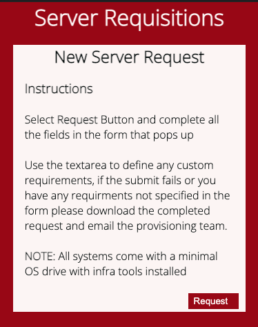

  + A responsive order form that prompts users to fill out the required information for an order.
    + User Stories Covered: 1
      + Smaller Screen size modal Screenshot.   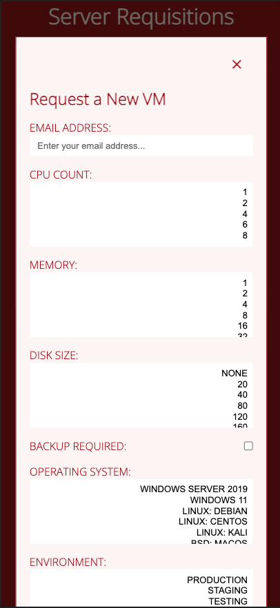
      + Larger Screen size modal Screenshot.   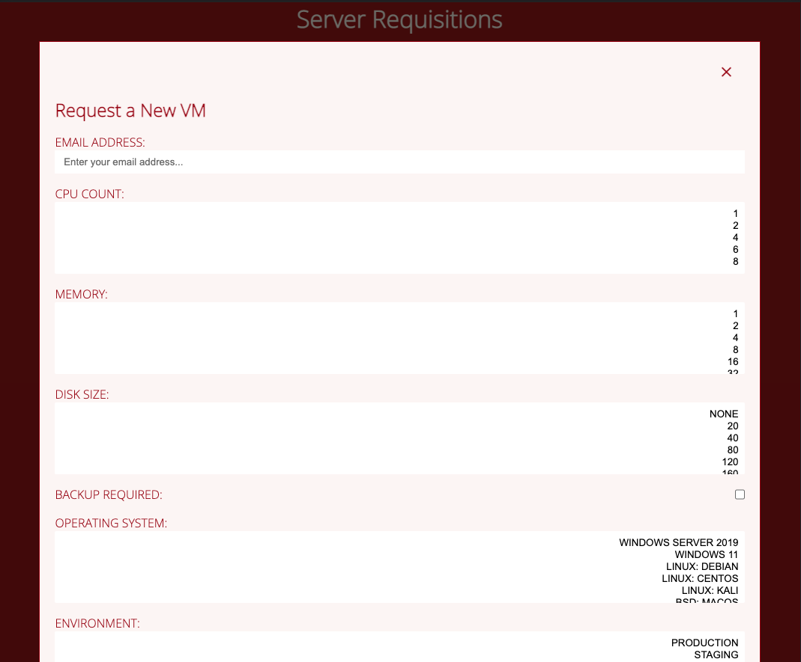

  + A mocked API call page that populates the form with the current available options when opened or cleared at an [endpoint](https://bovinehero.com/vm-order-generator//assets/mocks/sample.json) /assets/mocks/sample.json and a Checkbox option for Backups. - As this is a mocked call on the website the data is cached thus a full refresh of the endpoint page is required if it changes.
    + User Stories Covered: 3, 4, 5, 6, 7, 8 & 9
    + Mock Endpoint Screenshot.   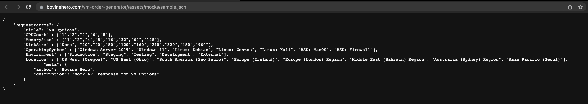

  + Use of `required` HTML attribute for client side validation on the site owner's mandatory items checklist. - Server side validation is beyond the scope of this project
    + User Stories Covered: 4, 6, 7, 8 & 9
    + Required attributes in code Screenshot.   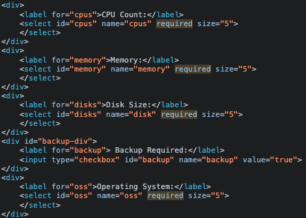

  + Form control buttons to Download, Clear, Cancel and Submit the Order. - The Submit is forwarded to the CI formdump [service](https://formdump.codeinstitute.net/) to mock a POST downstream.
    + User Stories Covered: 1 & 10
    + Form Buttons Screenshot.   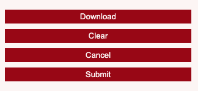

  + Notes textbox that is submitted with the form details to provide a way to communicate custom notes downstream.
    + User Stories Covered: 3 & 11    
    + Notes Area Screenshot.   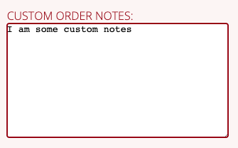

+ 404.html

  + Leverages the github pages jekyll engine to provide a custom 404 experience for users and return users back to the site if they end up in a non-existent child domain.
    + Styling here is inline as any http calls to child directories cannot be reliably referneced by links in the header, specifically users could manually input non-existing child directories into the url bar and would not see the styling.
    + Similarly the link back to the home page needs to directly reference the home url [https://bovinehero.com/vm-order-generator/index.html](https://bovinehero.com/vm-order-generator/index.html) as relative referencing will not guarantee a return to the home page if non-existent child directories are inputted into the url.
    + User Stories Covered: 
    + Link back home:   

### Future Implementations

+ Upstream Database system and API to make the available configurations call more real time.
+ Downstream API integration to place the order request into a work queue
+ The backend form validation, as the form control is implemented only on client side technologies a tech savvy user could bypass these and post direct to the form endpoint without declaring values for all the inputs.

### Accessibility Features
I have been mindful during coding to ensure that the website is as accessible friendly as possible. I have achieved this by:

+ Using semantic HTML.
+ Ensuring that there is a sufficient colour contrast throughout the site.

## Testing

### HTML Validation

The W3C Markup Validation Service was used to validate the HTML of the website. 

index.html [results](https://validator.w3.org/nu/?doc=https%3A%2F%2Fbovinehero.com%2Fvm-order-generator%2Findex.html) - No Errors or Warnings Found

### CSS Validation

The W3C Jigsaw CSS Validation Service was used to validate the CSS of the website.

site [results](https://jigsaw.w3.org/css-validator/validator?uri=https%3A%2F%2Fbovinehero.com%2Fvm-order-generator%2F&profile=css3svg&usermedium=all&warning=1&vextwarning=&lang=en) - No Errors or Warnings Found

### JavaScript Validation

The JSHint was used to validate the JavaScript of the website.

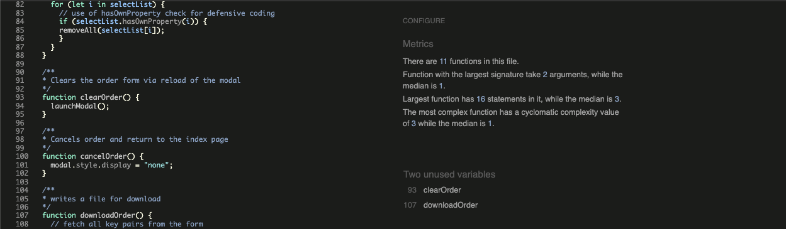

Warnings displayed:

| **Level** | **Feature** | **Issue Description** | **Comment** |
|-------------|-------------|----------------------|-------------|
| Two unused variables | Modal Buttons | clearOrder & downloadOrder not used in script | These are both called on the HTML form in the modal - no issue |

### Accessibility

The WAVE WebAIM web accessibility evaluation tool was used to ensure the website met high accessibility standards.

+ index.html [results](https://wave.webaim.org/report#/https://bovinehero.com/vm-order-generator/index.html)

#### Errors

No Accessibility Errors on site

#### Alerts

1 Accessibility Alert discovered on site:

+ A `<noscript>` element is present. Not an issue as the content within `<noscript>` is a simple paragraph styled the same way as the text below.

### Performance

Performance testing was performed on lighthouse in Google Chrome's DevTools

#### index.html

No Issues Reported

### Device testing
The website was tested on the following devices:

1. MacBook Pro
2. IPhone 13
3. In addition, the website was tested using Google Chrome Developer Tools Device emulation for all available device options plus a custom setting for IPhone 5

### Browser Compatibility
The website was tested on the following browsers:

1. Google Chrome
2. Mozilla Firefox

### Testing user stories

Submit an Order with checkbox and backup
Download an Order no backup
Mandatory items check
Clear check
Cancel check

1. I would like to raise an order for a new VM

| **Feature** | **Action** | **Expected Result** | **Actual Result** |
|-------------|------------|---------------------|-------------------|
| Feature name | steps to test | Expected results  | Works as expected |
| Feature name | steps to test | Expected results  | Works as expected |
| Feature name | steps to test | Expected results  | Works as expected |

 

Submit an Order with email validation check

 
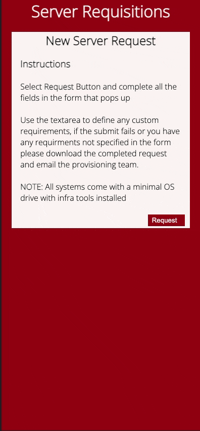

 

Download an order

 
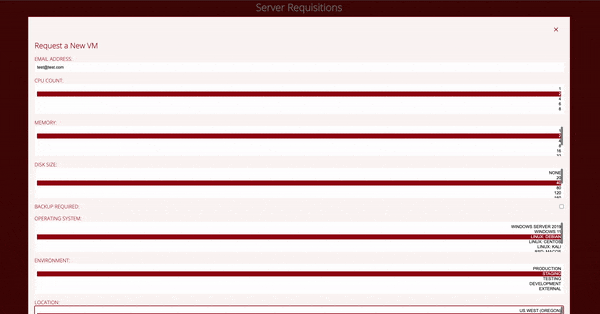
Downloaded file <a href="docs/text/vmOrder.txt">sample</a>

 

Clear Order form

 

 

Form validation check on VM values for a submit

 
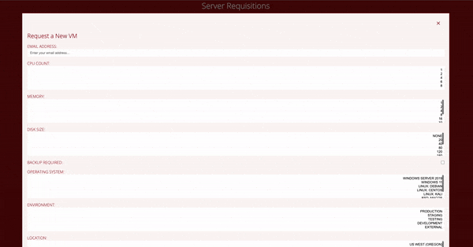

 

Cancel Order via button, "X" and click outside modal 

 
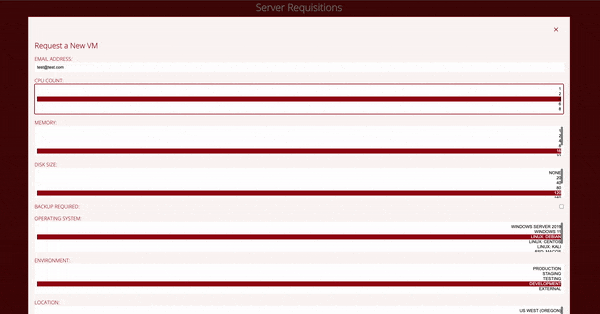

 

2. I would like to find instructions on how to complete an order.

| **Feature** | **Action** | **Expected Result** | **Actual Result** |
|-------------|------------|---------------------|-------------------|
| Feature name | steps to test | Expected results  | Works as expected |
| Feature name | steps to test | Expected results  | Works as expected |
| Feature name | steps to test | Expected results  | Works as expected |

 

Feature 1

 

 

Feature 2

 

 

Feature 3

 

 

3. When the standard form doesn't meet my requirements I would like to specify custom information in the request.

| **Feature** | **Action** | **Expected Result** | **Actual Result** |
|-------------|------------|---------------------|-------------------|
| Feature name | steps to test | Expected results  | Works as expected |
| Feature name | steps to test | Expected results  | Works as expected |
| Feature name | steps to test | Expected results  | Works as expected |

 

Feature 1

 

 

Feature 2

 

 

Feature 3

 

 

4. I would like users to always specify the hardware of the VM

| **Feature** | **Action** | **Expected Result** | **Actual Result** |
|-------------|------------|---------------------|-------------------|
| Feature name | steps to test | Expected results  | Works as expected |
| Feature name | steps to test | Expected results  | Works as expected |
| Feature name | steps to test | Expected results  | Works as expected |

 

Feature 1

 

 

Feature 2

 

 

Feature 3

 

 

5. I would like to request a backup of the system when needed

| **Feature** | **Action** | **Expected Result** | **Actual Result** |
|-------------|------------|---------------------|-------------------|
| Feature name | steps to test | Expected results  | Works as expected |
| Feature name | steps to test | Expected results  | Works as expected |
| Feature name | steps to test | Expected results  | Works as expected |

 

Feature 1

 

 

Feature 2

 

 

Feature 3

 

 

6. I would like users to always specify an environment to deploy the VM to

| **Feature** | **Action** | **Expected Result** | **Actual Result** |
|-------------|------------|---------------------|-------------------|
| Feature name | steps to test | Expected results  | Works as expected |
| Feature name | steps to test | Expected results  | Works as expected |
| Feature name | steps to test | Expected results  | Works as expected |

 

Feature 1

 

 

Feature 2

 

 

Feature 3

 

 

7. I would like users to always specify a location to deploy the VM to

| **Feature** | **Action** | **Expected Result** | **Actual Result** |
|-------------|------------|---------------------|-------------------|
| Feature name | steps to test | Expected results  | Works as expected |
| Feature name | steps to test | Expected results  | Works as expected |
| Feature name | steps to test | Expected results  | Works as expected |

 

Feature 1

 

 

Feature 2

 

 

Feature 3

 

 

8. I would like users to always specify the OS type that is installed

| **Feature** | **Action** | **Expected Result** | **Actual Result** |
|-------------|------------|---------------------|-------------------|
| Feature name | steps to test | Expected results  | Works as expected |
| Feature name | steps to test | Expected results  | Works as expected |
| Feature name | steps to test | Expected results  | Works as expected |

 

Feature 1

 

 

Feature 2

 

 

Feature 3

 

 

9. I would like users to always specify an identifing email address for their order

| **Feature** | **Action** | **Expected Result** | **Actual Result** |
|-------------|------------|---------------------|-------------------|
| Feature name | steps to test | Expected results  | Works as expected |
| Feature name | steps to test | Expected results  | Works as expected |
| Feature name | steps to test | Expected results  | Works as expected |

 

Feature 1

 

 

Feature 2

 

 

Feature 3

 

 

10. I would like the data posted to the endpoint to be downloadable incase the downstream endpoint fails

| **Feature** | **Action** | **Expected Result** | **Actual Result** |
|-------------|------------|---------------------|-------------------|
| Feature name | steps to test | Expected results  | Works as expected |
| Feature name | steps to test | Expected results  | Works as expected |
| Feature name | steps to test | Expected results  | Works as expected |

 

Feature 1

 

 

Feature 2

 

 

Feature 3

 

 

11. I would like users to be able to communicate custom requirments in an order

| **Feature** | **Action** | **Expected Result** | **Actual Result** |
|-------------|------------|---------------------|-------------------|
| Feature name | steps to test | Expected results  | Works as expected |
| Feature name | steps to test | Expected results  | Works as expected |
| Feature name | steps to test | Expected results  | Works as expected |

 

Feature 1

 

 

Feature 2

 

 

Feature 3

 

 

## Bugs

Discuss the Bugs

## Deployment & Local Development

All of the following steps require a logged in github account.

### Deployment
Github Pages was used to deploy the live website. 
The instructions to achieve this are available [here](https://docs.github.com/en/pages/getting-started-with-github-pages/creating-a-github-pages-site)

### How to Fork
To fork this repository:

1. Go to the repository for this project.
2. Click the Fork button in the top right corner.

### How to Clone
To clone this repository:

1. Go to the repository for this project.
2. Click on the code button, select whether you would like to clone with HTTPS, SSH or GitHub CLI and copy the link shown.
3. Open the terminal in your code editor and change the current working directory to the location you want to use for the cloned directory.
4. Type 'git clone' into the terminal and then paste the link you copied in step 3. Press enter.

## Credits

### Code Used

[W3C Schools](https://www.w3schools.com/) for proof of concept attempts
[css-tricks](https://css-tricks.com/snippets/css/a-guide-to-flexbox/) for a review on flexbox
[mdm web docs](https://developer.mozilla.org/en-US/docs/Learn) for various CSS, HTML and Javascript information.

### Content
No borrowed Content in this project

### Media
No borrowed Media in this project

## Acknowledgments
I would like to acknowledge the following people who helped me along the way in completing my second CI project:

Ed Bradly - for his insights into flexbox, grid and why mobile first will save you from headaches

Mo Shami - for being the mentor that set me on the right path and provided me with mid and final feedback prioir to submission.

Offensive Security - for the defensive JavaScript advice in the JS for loops.